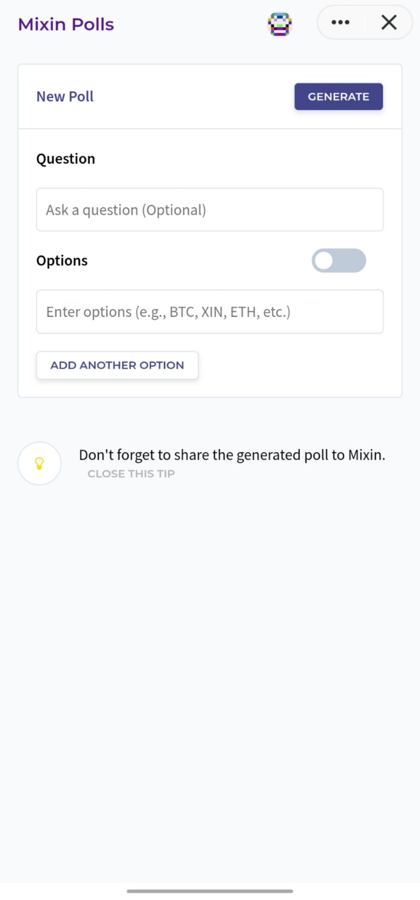

# mixin-polls-web

> Generate polls for Mixin users. Web front-end for [Mixin Polls](https://github.com/tougee/mixin-polls), fork from [gh-polls-web](https://github.com/srph/gh-polls-web)

Searching for `7000104378` in [Mixin Messenger](https://mixin.one/messenger) and start using.

<p align="center">
    
</p>

## Build Setup

``` bash
# install dependencies
npm install

# serve with hot reload at localhost:8082
npm run dev

# build for production with minification
npm run build

# build for production and view the bundle analyzer report
npm run build --report
```

For detailed explanation on how things work, checkout the [guide](http://vuejs-templates.github.io/webpack/) and [docs for vue-loader](http://vuejs.github.io/vue-loader).
